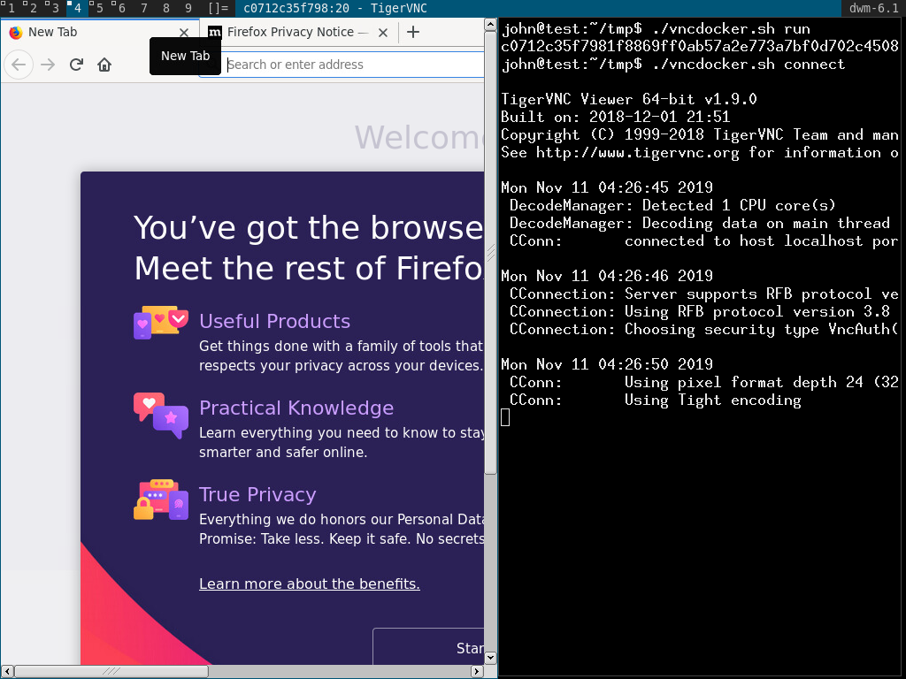

# vncdocker

Run gui applications as normal user with `docker` over `VNC with SSH`.

As display server used `xvfb`.

As vnc server used `x11vnc`.

VNC connection secured by ssh.

Sharing X display server with gui application over VNC with SSH should be more secure then sharing X display server from host OS with docker.

```
Run gui applications with docker over VNC with SSH.

	configure       : generate needed files used by script
	build           : build docker image
	run             : run docker image
	connect         : connect to the docker image

	clean           : clean generated files

	run_debug       : run docker container as 
	disconect       : stop and delete docker container

EXAMPLE
	./vncdocker configure
	./vncdocker build
	./vncdocker run
	./vncdocker connect
```	


